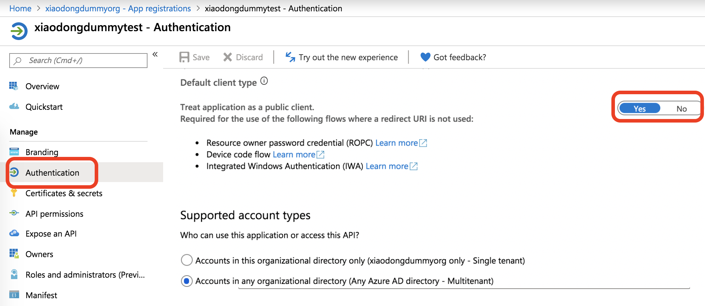
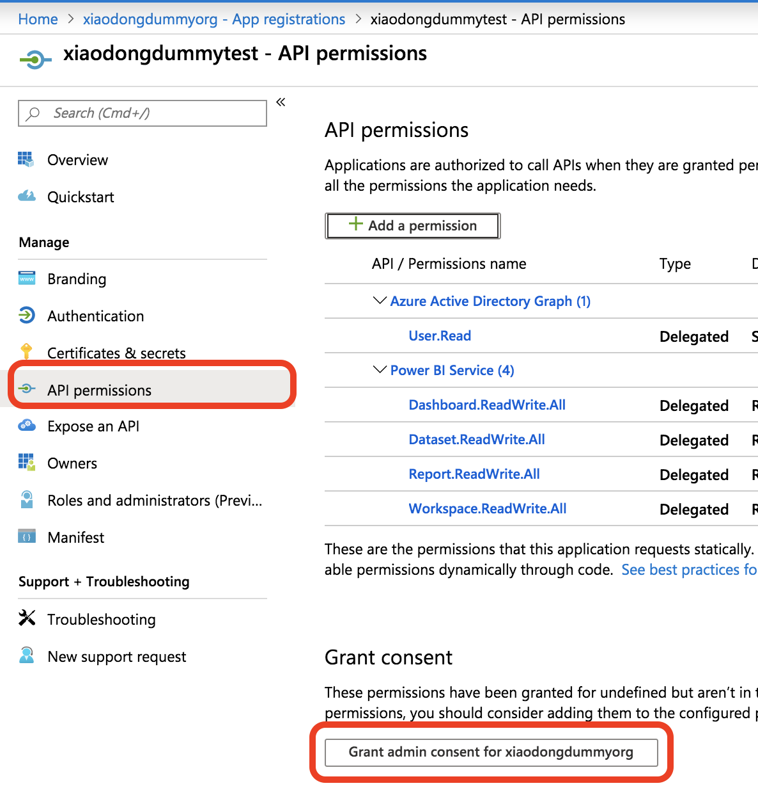
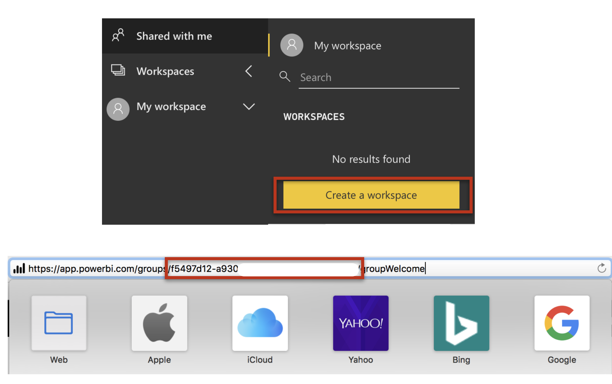
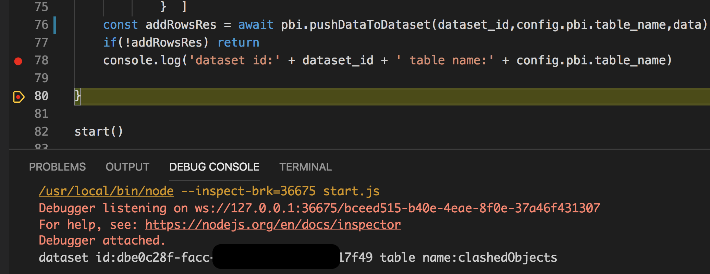
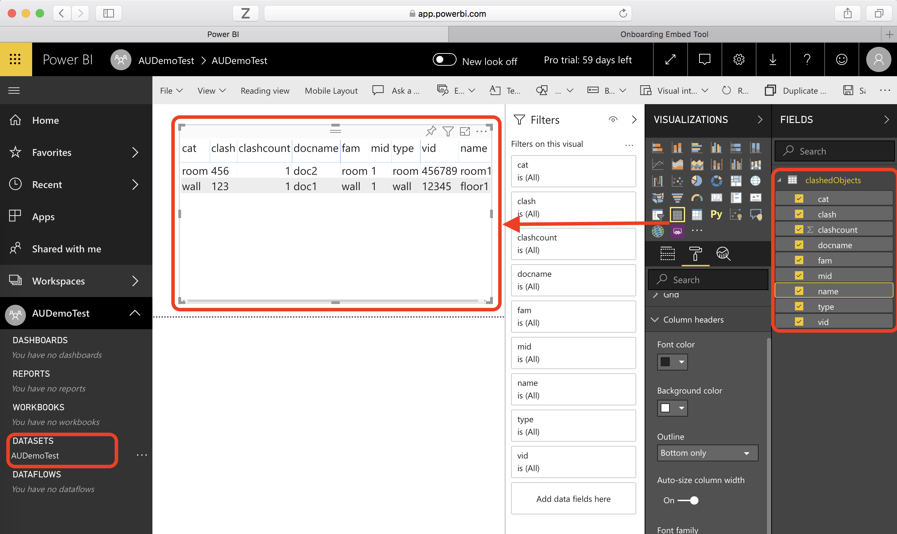
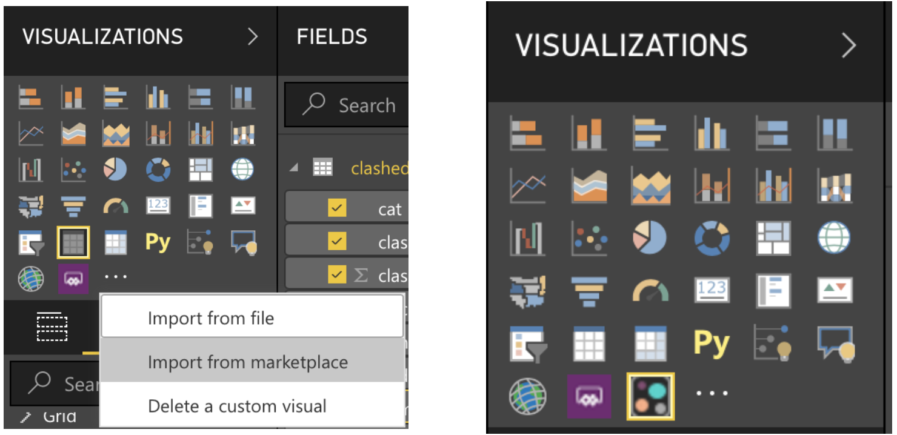
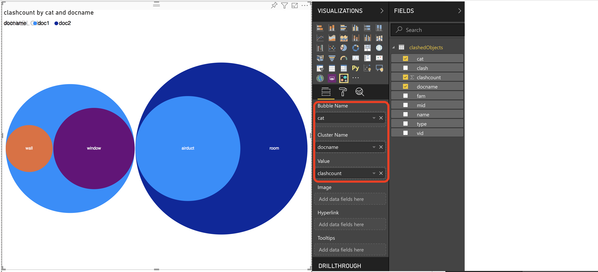
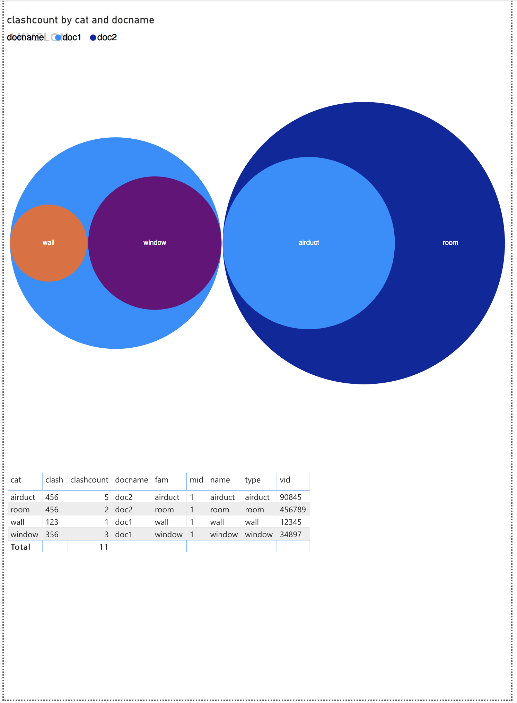
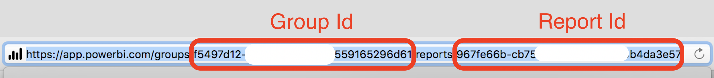

# PowerBI Configuration Guideline

This tutorial is a guideline on how to configure the relevant environments of [PowerBI](https://powerbi.microsoft.com/en-us/) for the [Model Coordination API sample](../README.md) : analyze clash data. 

PowerBI provides a couple of types of dataset:

* DataSource (from file or cloud database). To update a report, you will need to refresh the data source, and refresh the dataset, but such dataset has limit of refresh rate per day.
* Stream Dataset: typically for IoT scenarios with instant data update. 
* Push Data: doesn't contain a formal definition of a data source, so they don't require you to perform a data refresh in Power BI. You refresh them by pushing your data into the dataset through an external service or process.
    
In this [Model Coordination API sample](../README.md), will allow the user to switch the documents pair in a matrix view. It reuses the same report & dataset template and refreshes the dataset (updating report accordingly) on-demand time to time. The time rate is uncertain. So **Push Data** is the best choice for this sample. 

Check [Data refresh in Power BI](https://docs.microsoft.com/en-us/power-bi/refresh-data) for more information.

## Steps

1. **PowerBI Account**: Follow the tutorial to [sign up for Power BI](https://docs.microsoft.com/en-us/power-bi/service-self-service-signup-for-power-bi). Input your username and password to _pbiUsername_ and _pbiPassword_ variables in [config.js](./config.js)

    Note: _Power BI doesn't support email addresses provided by consumer email services or telecommunications providers. To finish signing up, try using an email address assigned by your work or school. OR create tenant user(refer to step #2)_

2. Register an Azure AD application to use with Power BI using the [Power BI App Registration Tool](https://dev.powerbi.com/apps). Make a note of your Application Id and add it to _applicationId_ variable in [config.js](./config.js)

       
 
 **Troubleshooting**: If your work/school account has not permitted to register the application, try to create in the [Azure Directory](https://portal.azure.com/#create/Microsoft.AzureActiveDirectory) a [tenant user](https://docs.microsoft.com/en-us/power-bi/developer/create-an-azure-active-directory-tenant). Using the tenant account, register an application of PowerBI to work with the PowerBI app. Or check with the administrator of your work/school to add the related permissions on your main account.

 
      
 
3. In order to get OpenId token without authorization workflow, ensure the following settings are done:
 
 * User or tenant user will have a role with **application administrator** permission.

     

 * The default client type is treated as a **public client**.

      

 * Grant consent of the application to all users of the **Azure Directory**

       
  
4. Login to [PowerBI web app](http://app.powerbi.com), switch to workspace and create a dataset and a report. From the address box of the browser, copy the workspace id (_group id_ in API) to the _workspaceId_ variable in [config.js](./config.js)

       

5. When the account info and relevant ids are ready, input your desired dataset name and table name in [config.js](./config.js), 

```
pbi:{
     pbiUsername : '<your PowerBI account name>',
     pbiPassword : '<your PowerBI password>', 
     AuthorityUrl : 'https://login.microsoftonline.com/common',
     resourceUrl : 'https://analysis.windows.net/powerbi/api',
     apiUrl : 'https://api.powerbi.com',
     embedUrlBase : 'https://app.powerbi.com', 
     applicationId : '<your PowerBI application id>',
     workspaceId : '<your PowerBI workspace (group) id>', 
     dataset_name:'<your PowerBI dataset name>',
     table_name:'<your PowerBI table name>'
  } 
```
finally run 

```
    npm install
    node start.js
```
    
   It will create dataset with the desired name and table schema. The table columns will be defined with the same schema from a clash analysis from Model Coordination API. Two dummy rows are created for the design of the PowerBI report in the next step.
   
   

6.After step #5 succeeds, login to [PowerBI web app](http://app.powerbi.com), switch to the workspace, click the new dataset to check if it can be open without any problem. Based on this dataset, insert table view, checking all the data column boxes.

      

7.Add Bubble Chart widge to the view from PowerBI Market.


      


8.Insert bubble view to the report. _cat_ as the bubble name, _ClashCount_ as the bubble value, _docname_ as the cluster.

      

9.Arrange the table view and bubble view vertically and set the report size, in order to fit to the UI of the [sample of Model Coordination API](../README.md). And now go ahead and Save it.

      

10.Copy the report id, dataset id, workspace id from the URL for adding it in the configuration of [Model Coordination API sample](../README.md).

      


Congratulations! you are ready to integrate with the [WebSample](../WebSample/README.md) now!
