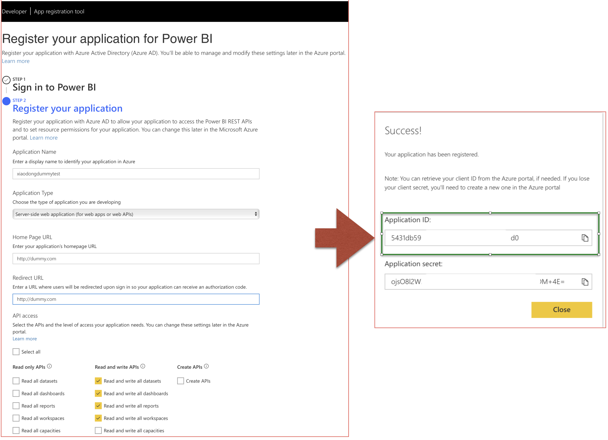
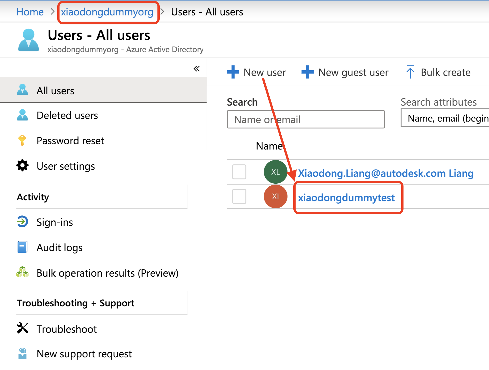
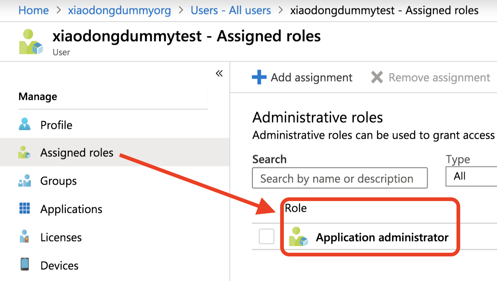

# PowerBI Configuration Guideline

This tutorial is a guideline on how to configure relevant environments of [PowerBI](https://powerbi.microsoft.com/en-us/) for the [sample of Model Coordination API](../README.md) : analyze clash data. 

PowerBI provides a couple of types of dataset:
* DataSource (from file or cloud database). To update a report, you will need to refresh the data source, and refresh the dataset, but such dataset has limit of refresh rate per day.
* Stream Dataset: typically for IoT scenario with instant data updating. 
* Push Data: doesn't contain a formal definition of a data source, so they don't require you to perform a data refresh in Power BI. You refresh them by pushing your data into the dataset through an external service or process.
    
In this [sample of Model Coordination API](../README.md), it allows the user to switch the documents pair in matrix view. It reuses the same report & dataset template and refreshes the dataset (updating report accordingly) on-demand time to time. The time rate is uncertain. So **Push Data** is the best choice for this sample. Check [Data refresh in Power BI](https://docs.microsoft.com/en-us/power-bi/refresh-data) for more information.

## Steps

1. **PowerBI Account**: Follow the tutorial to [sign up for Power BI](https://docs.microsoft.com/en-us/power-bi/service-self-service-signup-for-power-bi). Input your user name and password to _pbiUsername_ and _pbiPassword_ in [config.js](./config.js)

    Note: _Power BI doesn't support email addresses provided by consumer email services or telecommunications providers. To finish signing up, try using an email address assigned by your work or school. OR create tenant user(refer to step #2)_

2. [Register an Azure AD application to use with Power BI](https://docs.microsoft.com/en-us/power-bi/developer/register-app). They way [Power BI App Registration Tool](https://dev.powerbi.com/apps) is recommended. Make a note with Application Id. Input the id to _applicationId_ in [config.js](./config.js)

       
 
    **Troubleshooting**: If your work/school account has not permission to register application, try to create a [Azure Directory](https://portal.azure.com/#create/Microsoft.AzureActiveDirectory) and create a [tenant user](https://docs.microsoft.com/en-us/power-bi/developer/create-an-azure-active-directory-tenant). By the tenant account, register application of PowerBI to work with PowerBI app. OR check with administrator of your work/school to add related permissions on your main account.
 
       
 
3. In order to get OpenId token without authorization workflow, ensure the following settings are done:
 * user or tenant user has role with **application administrator**

     

 * default client type is treated as **public client**.

      

 * Grant consent of the application to all users of the **Azure Directory**

       
  
4. log in [PowerBI web app](http://app.powerbi.com), switch to the workspace you want to create dataset and report. From address box of the browser, copy the workspace id (_group id_ in API) to _workspaceId_ [config.js](./config.js)

       

5. When the account info and relevant ids are ready, input your desired dataset name and table name in [config.js](./config.js), finally run 
    ```
    node start.js
    ```
   It will create dataset with the desired name and table schema. The table columns will be defined with the same schemea from clash analysis of Model Coordination API. Two dummy rows are created for design PowerBI report in step #6

       

6. After step #5 succeeds, log in [PowerBI web app](http://app.powerbi.com), switch to the workspace, click the new dataset to check if it can be opened without problem. Based on this dataset, insert table view, ticking all the data columns.

       

7. Add Bubble Chart widge to the view from PowerBI Market.


       


8. Insert bubble view to the report. _cat_ as bubble name, _ClashCount_ as bubble value, _docname_ as cluster.


       

9. Arrange table view and bubble view vertically and set the report size, in order to fit to the UI of the [sample of Model Coordination API](../README.md). 

       

10. Copy the report id, dataset id, workspace id for configuration of [sample of Model Coordination API](../README.md).

       


Congratulations! you are ready to integrate with  [sample of Model Coordination API](../README.md) now!
