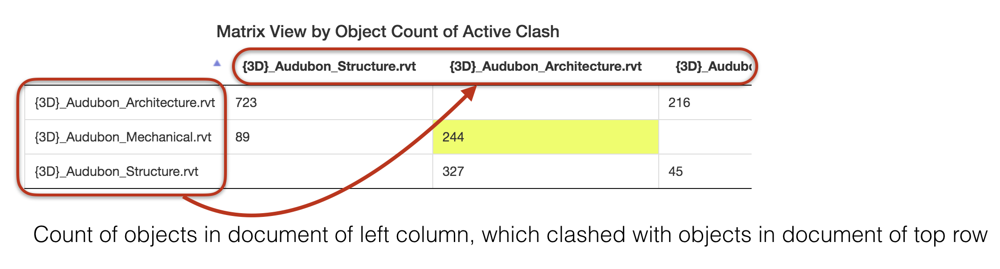

# BIM 360 Model Coordination: PowerBI Anlaysis and Clash Issues 

 

## Description

This repository demonstrates the scenario: analyze clash data by BIM 360 Model Coordination API with [PowerBI](https://powerbi.microsoft.com/en-us/). It is compatible with Model Coordination of Autodesk Construction Cloud (ACC).

## Thumbnail

  

   

## Live version

Live version: [bim360-clash-powerbi-analysis.herokuapp.com](https://bim360-clash-powerbi-analysis.herokuapp.com)

> To use this sample with your BIM 360 you need to "Enable Custom Integrations". At the app top-right, click **Config** to get detailed steps.

Watch [this video](https://youtu.be/pQaO2Dta97g) on how to play this demo.

## Demonstrations

### Demo 1: Matrix View of Clash

To work with the sample, firstly upload some source models to BIM 360/ACC folder, then create model set in Model Coordination module with this folder. Please refer to [BIM 360 Model Coordination documentation](http://help.autodesk.com/view/BIM360D/ENU/?guid=GUID-38CC3A1C-92FF-4682-847F-9CFAFCC4CCCE) for details. Check `Sample Files` folder for testing RVT files, it includes two versions of models set.

1. After the user logs in, select one project in the left panel tree.
2. After modelset list is refreshed, select one modelset. *Note: the sample only works with the modelsets which are created after Oct 1st Because Model Coordination API updated and some logic of documents mapping are changed.*  
3. When one modelset is selected, the code will firstly dump all relevant data of clash, index of objects, and build the map of documents and clashes. Finally a **Matrix View by Object Count of Active Clash** will be generated. It is same to Grid View of Clash on BIM 360 UI. 

The count in the table indicates how many objects of the document (left column) have a clash with the document (top row). The objects will be excluded if their corresponding clashes have been assigned with a clash issue. Check [API document](https://dev.forge.autodesk.com/en/docs/bim360/v1/tutorials/model-coordination/mc-concept-clash/?sha=6092_51) for more detail on what is matrix view of clash.

  

   

### Demo 2: PowerBI Anlaysis
1. When **Matrix View by Object Count of Active Clash** is ready, click one cell which has value. 
2. The corresponding pair of documents (LEFT & RIGHT) will be loaded in the Forge Viewer
3. At the same time, the corresponding PowerBI report is loaded. It indicates the clashes by object categories, and clustered by the two documents.
4. Click a category, the corresponding table records will be shown up in the table view of PowerBI. The classes will be highlighted in the Forge Viewer. All objects of LEFT document will be in red, while objects of RIGHT document will be in blue.
5. Click **Export Data** of PowerBI view to add the filtered records to Excel.
6. Click a single record in the table view, the clahes will be highlighted as well.
 
   

  

## Technology Architecture

1. The sample firstly downloads the model set data, clash data. Based on the relationship, the code analyzes the data to build the mapping among clash document, version URN and viewable guid etc. The mapping is saved to **docsMap.json**
 
2. When a cell of matrix view is selected, the corresponding two documents information will be sent to server. The method **clashedObjectsInTwoDocs** in [analyze.js](./server/analyze.js) will get out all clashes which occur between the two documents, query the properties of the two documents by Model Properties API and map with clash data, finally build records. These records will be pushed to PowerBI data, and refresh PowerBI report accordingly. Check [ReadMe of PowerBI tool](./PowerBITool/PowerBI.md) for more details.

# Setup

## Prerequisites
1. **PowerBI Configuration**: Check [ReadMe of PowerBI tool](./PowerBITool/PowerBI.md). Get _account name_, _account password_, _application id_, _workspace id (group id)_, _dataset id_, _report id_, and input them to [config.js](./server/config.js)
2. **BIM 360 Account**: must be Account Admin to add the app integration. [Learn about provisioning](https://forge.autodesk.com/blog/bim-360-docs-provisioning-forge-apps). 
3. **Forge Account**: Learn how to create a Forge Account, activate subscription and create an app at [this tutorial](http://learnforge.autodesk.io/#/account/). Get _Forge client id_, _Forge client secret_ and _Forge callback url_ and input them to [config.js](./server/config.js)
4. **Node.js**: basic knowledge with [**Node.js**](https://nodejs.org/en/).
5. **JavaScript** basic knowledge with **jQuery** and **Bootstrap** 

## Running locally
Clone this project or download it. It's recommended to install [GitHub desktop](https://desktop.github.com/). To clone it via command line, use the following (**Terminal** on MacOSX/Linux, **Git Shell** on Windows):

    git clone https://github.com/autodesk-forge/forge-bim360-clashissue-powerbi

Note: This repo contains [large RVT sample files](./Source Files) and uses [`git lfs`](https://git-lfs.github.com/), make sure you clone accordingly if you need these test files.

Open the project folder in **Visual Sutdio Code**. Install the required packages, set the enviroment variables with your client ID & secret and finally start it. Via command line, navigate to the folder where this repository was cloned, then `WebSample` subfolder, and use the following:

Mac OSX/Linux (Terminal)

    npm install
    export FORGE_CLIENT_ID=<<YOUR CLIENT ID FROM DEVELOPER PORTAL>>
    export FORGE_CLIENT_SECRET=<<YOUR CLIENT SECRET>>
    export FORGE_CALLBACK_URL=<<YOUR CALLBACK URL>>
    npm start

Windows (use **Node.js command line** from Start menu)

    npm install
    set FORGE_CLIENT_ID=<<YOUR CLIENT ID FROM DEVELOPER PORTAL>>
    set FORGE_CLIENT_SECRET=<<YOUR CLIENT SECRET>>
    set FORGE_CALLBACK_URL=<<YOUR CALLBACK URL>>
    npm start

Open the browser: [http://localhost:3000](http://localhost:3000).

## Deployment

To deploy this application to Heroku, the **Callback URL** for Forge must use your `.herokuapp.com` address. After clicking on the button below, at the Heroku Create New App page, set your Client ID, Secret and Callback URL for Forge.

Watch [this video](https://www.youtube.com/watch?v=Oqa9O20Gj0c) on how deploy samples to Heroku. 
 

## Further Reading
- [Model Coordination](https://forge.autodesk.com/en/docs/bim360/v1/overview/field-guide/model-coordination/)
- [BIM 360 API](https://forge.autodesk.com/en/docs/bim360/v1/overview/) and [App Provisioning](https://forge.autodesk.com/blog/bim-360-docs-provisioning-forge-apps)
- [Data Management API](https://forge.autodesk.com/en/docs/data/v2/overview/)
- [Viewer](https://forge.autodesk.com/en/docs/viewer/v7)

## Tutorials
- [Model Coordination API](https://forge.autodesk.com/en/docs/bim360/v1/tutorials/model-coordination)
- [View BIM 360 Models](http://learnforge.autodesk.io/#/tutorials/viewhubmodels)

## Blogs

- [Forge Blog](https://forge.autodesk.com/categories/bim-360-api)
- [Field of View](https://fieldofviewblog.wordpress.com/), a BIM focused blog

### Tips & Tricks

-  Since the clash data might be large, don't pull the file locally and then process it. Decompressing and streaming the results on the fly would also be recommended, as showned in this sample [utility.js](./server/utility.js) 
- To make a simple demo, this sample  does not use database to manage the clash data. 
- On client (browser) side, it may be more efficient to manage the data by IndexDB if the app requires to perform various analysis in different browser sessions.

### Troubleshooting

- **Cannot see my BIM 360 projects**: Make sure to provision the Forge App Client ID within the BIM 360 Account, [learn more here](https://forge.autodesk.com/blog/bim-360-docs-provisioning-forge-apps). This requires the Account Admin permission.

- The code of highlighting objects within Forge Viewer requires the corresponding documents of  clash instances have been loaded. If not, the highlighting will not work, try again when the loading is completed

## License

This sample is licensed under the terms of the [MIT License](http://opensource.org/licenses/MIT). Please see the [LICENSE](LICENSE) file for full details.

## Written by

- Xiaodong Liang [@coldwood](https://twitter.com/coldwood),[Forge Partner Development](http://forge.autodesk.com)
- Reviewed by Jaime Rosales Duque [@AfroJme](https://twitter.com/AfroJme), [Forge Partner Development](http://forge.autodesk.com)
